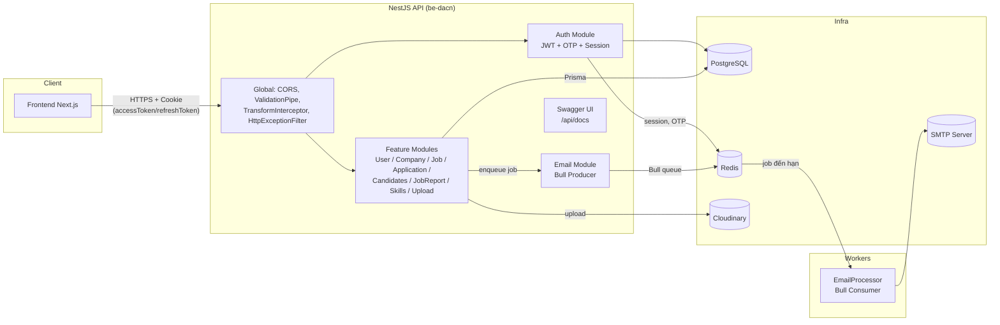

# API Tuyển Dụng (be-dacn)

Backend cho hệ thống quản lý tuyển dụng, kết nối nhà tuyển dụng (recruiter) và ứng viên (applicant). Xây dựng bằng [NestJS](https://nestjs.com/) + [Prisma](https://www.prisma.io/) trên PostgreSQL, dùng Redis/Bull cho session & hàng đợi tác vụ nền, Cloudinary để lưu file.

## Mục lục

- [Công nghệ sử dụng](#công-nghệ-sử-dụng)
- [Cấu trúc thư mục](#cấu-trúc-thư-mục)
- [Sơ đồ kiến trúc](#sơ-đồ-kiến-trúc)
- [Mô hình dữ liệu](#mô-hình-dữ-liệu)
- [Hướng dẫn chạy dự án](#hướng-dẫn-chạy-dự-án)
- [Biến môi trường](#biến-môi-trường)
- [Quyết định thiết kế](#quyết-định-thiết-kế)

## Công nghệ sử dụng

| Thành phần       | Lựa chọn                                             |
| ----------------- | ----------------------------------------------------- |
| Framework         | NestJS 11 (Express platform)                          |
| Ngôn ngữ          | TypeScript                                             |
| Database          | PostgreSQL (qua `@prisma/adapter-pg` driver adapter)  |
| ORM               | Prisma 7                                               |
| Cache / phiên đăng nhập | Redis (`ioredis`, `@nestjs-modules/ioredis`)     |
| Hàng đợi tác vụ nền | Bull (`@nestjs/bull`), backend là Redis              |
| Xác thực          | JWT (access + refresh token) qua `@nestjs/jwt`, hash mật khẩu bằng `argon2` |
| Email             | `@nestjs-modules/mailer` + Nodemailer (SMTP), template render qua Handlebars |
| Lưu trữ file      | Cloudinary (CV, ảnh, logo công ty)                    |
| Tài liệu API      | Swagger (`@nestjs/swagger`) tại `/api/docs`           |
| Validate DTO      | `class-validator` / `class-transformer`               |

## Cấu trúc thư mục

```
be-dacn/
├── prisma/
│   ├── schema.prisma        # Định nghĩa toàn bộ model, enum của DB
│   ├── migrations/          # Lịch sử migration (chạy bằng prisma migrate)
│   └── seed.ts              # Seed dữ liệu khởi tạo (permissions, role hệ thống, ...)
├── src/
│   ├── main.ts               # Bootstrap ứng dụng: CORS, prefix /api/v1, Swagger, pipes/filters toàn cục
│   ├── app.module.ts         # Module gốc, khai báo Config/Redis/Bull/Mailer và import các feature module
│   ├── auth/                 # Đăng ký/đăng nhập, JWT, OTP xác thực thiết bị, quản lý session
│   │   ├── guard/            # AccessTokenGuard, RefreshTokenGuard, RolesGuard
│   │   ├── decorator/        # @Roles(), @GetUser() ...
│   │   └── dto/
│   ├── user/                  # Hồ sơ người dùng
│   ├── company/               # Công ty, thành viên công ty, role theo công ty (multi-tenant)
│   ├── permissons/            # Danh mục permission hệ thống
│   ├── job/                   # Tin tuyển dụng (CRUD, publish/close)
│   ├── job-category/          # Danh mục ngành nghề
│   ├── job-report/            # Báo cáo tin tuyển dụng vi phạm
│   ├── skills/                # Danh mục kỹ năng
│   ├── candidates/            # Nghiệp vụ phía ứng viên (resume, tìm việc, ...)
│   ├── application/           # Nộp đơn ứng tuyển, pipeline ATS (interview, offer, lịch sử trạng thái)
│   ├── upload/                 # Upload CV/ảnh lên Cloudinary
│   ├── email/                  # Hàng đợi & xử lý gửi email bất đồng bộ (Bull)
│   ├── prisma/                 # PrismaService (khởi tạo PrismaClient qua driver adapter pg)
│   └── common/                 # DTO response chuẩn hoá, filter, interceptor, interface dùng chung
├── generated/prisma/           # Prisma Client được generate (gitignored)
├── docker-compose.yaml         # Postgres + Redis cho môi trường dev
└── test/                       # e2e test (Jest + Supertest)
```

Mỗi feature module theo cùng một khuôn: `*.module.ts` (khai báo DI), `*.controller.ts` (route + guard/decorator), `*.service.ts` (business logic, gọi Prisma), `dto/` (input/output có validate).

## Sơ đồ kiến trúc



**Luồng chính:**

1. Toàn bộ request đi qua prefix `api/v1`, được `ValidationPipe` (whitelist + transform) kiểm tra DTO, sau đó `TransformInterceptor` bọc response thành `ApiResponseDto` thống nhất và `HttpExceptionFilter` chuẩn hoá lỗi.
2. `AccessTokenGuard` đọc JWT từ cookie `httpOnly`, xác thực bằng `@nestjs/jwt`; `RolesGuard` + decorator `@Roles()` kiểm tra `UserType` (APPLICANT/RECRUITER/ADMIN) ở tầng route. RBAC chi tiết theo công ty (Role/Permission/UserCompanyRole) nằm ở tầng dữ liệu cho các thao tác trong phạm vi công ty.
3. Các module nghiệp vụ (Job, Application, Company, Candidates, ...) dùng `PrismaService` để truy vấn Postgres qua driver adapter `@prisma/adapter-pg`.
4. Các email giao dịch (mời vào công ty, đổi trạng thái đơn ứng tuyển, gửi/offer phản hồi offer) được đẩy vào hàng đợi Bull (Redis) thay vì gửi đồng bộ, xử lý bởi `EmailProcessor` — tách rời việc gửi mail khỏi request chính. Riêng email OTP đăng nhập thiết bị mới được gửi trực tiếp trong `AuthService` vì cần phản hồi ngay trong luồng đăng nhập.
5. Upload CV/ảnh đi qua `UploadService`, stream trực tiếp lên Cloudinary rồi lưu URL/publicId vào Postgres.

## Mô hình dữ liệu

Định nghĩa đầy đủ tại [`prisma/schema.prisma`](./prisma/schema.prisma). Các nhóm model chính:

- **Auth & User**: `User`, `UserSession` (một thiết bị/refresh token = một session, hỗ trợ đăng xuất theo thiết bị).
- **RBAC đa công ty**: `Company`, `Role`, `Permission`, `RolePermission`, `UserCompanyRole` — một công ty có thể tự định nghĩa role tuỳ biến (`isCustom`), người dùng có role khác nhau ở mỗi công ty.
- **Tin tuyển dụng**: `Job`, `JobCategory`, `Skill`, `JobSkill`, `JobReport`.
- **Pipeline ứng tuyển (ATS)**: `Resume`, `ResumeImage`, `Application`, `ApplicationHistory` (audit log đổi trạng thái), `Interview`, `Offer`.

## Hướng dẫn chạy dự án

### Yêu cầu

- Node.js ≥ 20
- Docker (để chạy Postgres/Redis dev qua `docker-compose`), hoặc tự cài Postgres 15 + Redis 7

### Các bước

```bash
# 1. Cài dependency (tự động chạy `prisma generate` qua postinstall)
npm install

# 2. Tạo file .env (xem mục Biến môi trường bên dưới)

# 3. Khởi động Postgres + Redis cho dev
docker compose up -d

# 4. Áp dụng migration + seed dữ liệu (permission, role hệ thống, ...)
npx prisma migrate dev

# 5. Chạy ứng dụng ở chế độ watch
npm run start:dev
```

API chạy tại `http://localhost:3000/api/v1`, Swagger UI tại `http://localhost:3000/api/docs`.

### Lệnh khác

```bash
npm run build          # Build production (xoá dist/ cũ rồi nest build)
npm run start:prod     # Chạy bản build
npm run lint           # ESLint --fix
npm run format         # Prettier

npm run test           # Unit test
npm run test:e2e       # e2e test (Jest + Supertest)
npm run test:cov       # Coverage
```

## Biến môi trường

Tạo file `.env` ở thư mục gốc với các biến sau (không có `.env.example` sẵn trong repo — tổng hợp từ mã nguồn):

| Biến                  | Mô tả                                                              |
| ---------------------- | ------------------------------------------------------------------- |
| `DATABASE_URL`          | Connection string PostgreSQL (Prisma + `pg` pool)                  |
| `REDIS_URL`             | Connection string Redis (session, OTP, hàng đợi Bull)               |
| `PORT`                  | Cổng HTTP server (mặc định `3000`)                                  |
| `FRONTEND_URL`          | Origin của frontend, dùng cho CORS (mặc định `http://localhost:4000`) |
| `IS_DEV`                | `"true"` khi chạy local — quyết định `SameSite=Lax/None` và `Secure` của cookie |
| `SECRET_ACCESS_KEY`     | Secret ký JWT access token (hết hạn 15 phút)                        |
| `SECRET_REFRESH_KEY`    | Secret ký JWT refresh token (hết hạn 30 ngày)                       |
| `REFRESH_TOKEN_HMAC_SECRET` | Secret khoá HMAC-SHA256 dùng để băm refresh token trước khi lưu DB (độc lập với `SECRET_REFRESH_KEY` dùng để ký JWT) |
| `MAIL_HOST`, `MAIL_PORT`, `MAIL_USER`, `MAIL_PASS`, `MAIL_FROM` | Cấu hình SMTP gửi email (Nodemailer, ép IPv4 để tránh lỗi ENETUNREACH khi deploy) |
| `CLOUDINARY_NAME`, `CLOUDINARY_API_KEY`, `CLOUDINARY_API_SECRET` | Thông tin tài khoản Cloudinary lưu file        |

## Quyết định thiết kế

- **Cookie httpOnly thay vì Bearer token ở localStorage**: Frontend (Next.js) và backend luôn khác domain khi deploy (Vercel ↔ Render), nên access/refresh token được set qua cookie `httpOnly` + `Secure` + `SameSite=None` ở production để tránh lộ token qua XSS; chỉ nới lỏng thành `Lax`/không-`Secure` khi `IS_DEV=true` để dev local (cùng site, khác port) không cần HTTPS. Xem `AuthService.getCookieOptions`.
- **Giới hạn 3 phiên hoạt động + OTP cho thiết bị mới**: Mỗi tài khoản tối đa 3 `UserSession` không bị thu hồi. Khi đăng nhập từ thiết bị thứ 4 trở lên, session mới bị đánh dấu `isRevoked=true` và hệ thống gửi OTP (lưu tạm trong Redis, TTL 5 phút) — chỉ khi xác thực OTP đúng thì session mới được kích hoạt, đồng thời session cũ nhất bị thu hồi để giữ giới hạn 3 phiên.
- **Refresh token băm bằng HMAC-SHA256 có khoá**: Refresh token là chuỗi ngẫu nhiên entropy cao (JWT), không cần hàm băm chậm/tốn RAM như `argon2` (vốn dành cho mật khẩu entropy thấp) — dùng `crypto.createHmac('sha256', REFRESH_TOKEN_HMAC_SECRET)` vừa nhanh vừa an toàn hơn cho use case này, và vì HMAC là deterministic + có khoá nên `tokenHash` được dùng luôn làm khoá tra cứu DB (gộp cơ chế hash-để-xác-minh và sha256-để-tra-cứu trước đây thành một cột). Mỗi lần `refresh` thành công, `tokenHash` trên cùng session được ghi đè bằng hash của token mới (refresh token cũ hết hiệu lực ngay, single-use) — cố tình không lưu lịch sử token đã rotate để tránh làm phức tạp/ảnh hưởng logic đếm tối đa 3 thiết bị hoạt động ở `login()`.
- **RBAC hai tầng**: Guard `RolesGuard` + decorator `@Roles()` kiểm tra nhanh theo `UserType` (APPLICANT/RECRUITER/ADMIN) ngay ở tầng route cho các route đơn giản. Với nghiệp vụ đa công ty (một recruiter có thể thuộc nhiều công ty với quyền khác nhau), hệ thống dùng mô hình `Role`/`Permission`/`RolePermission`/`UserCompanyRole` ở tầng dữ liệu để hỗ trợ role tuỳ biến theo từng công ty (`isCustom`), thay vì cứng hoá quyền vào enum.
- **Prisma dùng driver adapter (`@prisma/adapter-pg`) thay vì kết nối mặc định**: Cho phép tái sử dụng `pg.Pool` (connection pooling rõ ràng, kiểm soát được số kết nối) và tương thích tốt hơn với môi trường serverless/containerized khi deploy.
- **Gửi email qua hàng đợi Bull (Redis) thay vì gửi đồng bộ**: Các email không cần phản hồi ngay trong request (mời vào công ty, đổi trạng thái đơn ứng tuyển, gửi/offer phản hồi offer) được `EmailService` đẩy vào queue và xử lý nền bởi `EmailProcessor`, tránh làm chậm response API và cô lập lỗi SMTP khỏi luồng nghiệp vụ chính. Email OTP đăng nhập là ngoại lệ — gửi trực tiếp vì người dùng cần nhận ngay để hoàn tất đăng nhập.
- **Response envelope thống nhất**: Mọi response (thành công lẫn lỗi) đều đi qua `TransformInterceptor` / `HttpExceptionFilter` để trả về cùng một hình dạng `ApiResponseDto` (`success`, `statusCode`, `message`, `data`/`errors`, `timestamp`, `path`), giúp frontend xử lý response nhất quán mà không cần biết chi tiết từng endpoint.
- **Soft delete cho dữ liệu nghiệp vụ chính**: `User`, `Company`, `Job` dùng cột `deletedAt` thay vì xoá cứng, bảo toàn liên kết lịch sử (đơn ứng tuyển, lịch phỏng vấn, offer) ngay cả khi công ty/tin tuyển dụng/tài khoản bị gỡ.
- **Upload file qua Cloudinary, không lưu local**: File CV/ảnh được stream thẳng lên Cloudinary (`upload_stream`), backend chỉ lưu `secure_url`/`public_id` trong Postgres — tránh phụ thuộc ổ đĩa local của server (không phù hợp khi scale ngang hoặc deploy trên nền tảng ephemeral filesystem).
